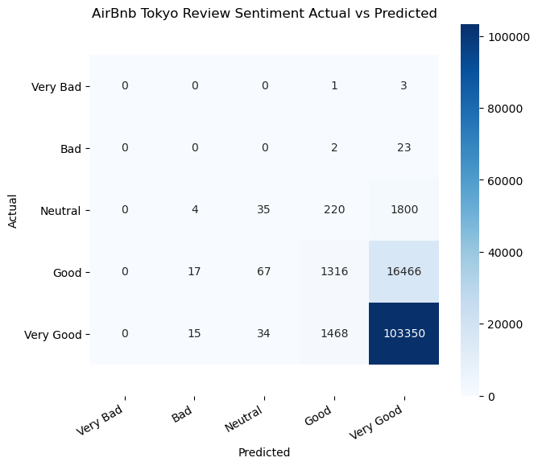

#### Summary

1. **Exploratory Data Analysis (EDA)**
- I processed and visualized the data to perform EDA.
2. **Price Prediction Modeling**
- I created a linear regression model with an adjusted R squared of 0.44 and a random forest model with an adjusted R squared of 0.87 for predicting listing prices using 15,551 Tokyo Airbnb listings.
- The root mean squared errors (RMSE) of the linear regression and the random forest models were 6,567 yen and 4,834 yen, respectively.
- I performed a 5-fold cross-validation on the random forest model and got an adjusted R squared of 0.71, which indicates that the model was overfitting.
3. **Sentiment Analysis**
- N-grams showed that highly rated listings were clean, in a great location, close to a train station, close to a convenience store, or had a great host.
- I created a logistic regression model with an accuracy score of 83.9% to perform sentiment analysis on 416,396 Tokyo Airbnb reviews. The model classifies listing reviews into 5 sentiment classes, very bad, bad, neutral, good, and very good.
- I performed a 5-fold cross-validation on the logistic regression model and got the mean accuracy score of 83.5%, which means that the model generalized well.

#### Top 10 Neighborhoods by Number of Listings

#### Box Plot for Listing Prices by Neighbour

#### Correlated Features for Listing Prices

#### Confusion Matrix

